/fluency/96/000000/github.png" width="60"/>
          <br><strong>GitHub</strong>
          <br><sub>@Siddheshwar-cloud</sub>
        </a>
      </td>
      <td align="center" width="200">
        <a href="https://linkedin.com/in/siddheshwar-yengudle">
          
          <br><strong>LinkedIn</strong>
          <br><sub>Connect with me</sub>
        </a>
      </td>
      <td align="center" width="200">
        <a href="https://twitter.com/siddheshwar_dev">
          
          <br><strong>Twitter</strong>
          <br><sub>@siddheshwar_dev</sub>
        </a>
      </td>
      <td align="center" width="200">
        <a href="mailto:siddheshwar.dev@gmail.com">
          
          <br><strong>Email</strong>
          <br><sub>Get in touch</sub>
        </a>
      </td>
    </tr>
  </table>
  
  <br>
  
  ### 📊 GitHub Stats
  
  
  
  
  
  <br>
  
  ### 🏆 Achievements
  
  
  
</div>

---

## 🤝 Contributing

Contributions are what make the open-source community amazing! Any contributions you make are **greatly appreciated**.

### How to Contribute

1. **Fork the Project**
```bash
   git clone https://github.com/Siddheshwar-cloud/TryCatchExample.git
```

2. **Create your Feature Branch**
```bash
   git checkout -b feature/AmazingFeature
```

3. **Commit your Changes**
```bash
   git commit -m 'Add some AmazingFeature'
```

4. **Push to the Branch**
```bash
   git push origin feature/AmazingFeature
```

5. **Open a Pull Request**

### 💡 Contribution Ideas

- 🐛 **Bug fixes** - Found a bug? Fix it!
- ✨ **New features** - Add more error handling patterns
- 📚 **Documentation** - Improve examples and explanations
- 🧪 **Tests** - Add comprehensive test cases
- 🎨 **UI/UX** - Enhance the README visuals
- 🌍 **Translations** - Translate to other languages

---

## 📄 License

<div align="center">

This project is licensed under the **MIT License** - see the [LICENSE](LICENSE) file for details.
```
MIT License

Copyright (c) 2024 Siddheshwar Yengudle

Permission is hereby granted, free of charge, to any person obtaining a copy
of this software and associated documentation files (the "Software"), to deal
in the Software without restriction, including without limitation the rights
to use, copy, modify, merge, publish, distribute, sublicense, and/or sell
copies of the Software, and to permit persons to whom the Software is
furnished to do so, subject to the following conditions:

The above copyright notice and this permission notice shall be included in all
copies or substantial portions of the Software.
```

[](https://opensource.org/licenses/MIT)

</div>

---

## 🙏 Acknowledgments

<div align="center">

Special thanks to the amazing blockchain community!

<table>
  <tr>
    <td align="center">
      <a href="https://docs.soliditylang.org/">
        
        <br><strong>Solidity Docs</strong>
      </a>
    </td>
    <td align="center">
      <a href="https://hardhat.org/">
        
        <br><strong>Hardhat Team</strong>
      </a>
    </td>
    <td align="center">
      <a href="https://openzeppelin.com/">
        
        <br><strong>OpenZeppelin</strong>
      </a>
    </td>
    <td align="center">
      <a href="https://ethereum.org/">
        
        <br><strong>Ethereum Foundation</strong>
      </a>
    </td>
  </tr>
</table>

### 🌟 Inspired By

- [Patrick Collins](https://github.com/PatrickAlphaC) - Smart Contract Education
- [OpenZeppelin Contracts](https://github.com/OpenZeppelin/openzeppelin-contracts) - Security Patterns
- [Ethereum Community](https://ethereum.org/community) - Continuous Learning

</div>

---

## 📚 Additional Resources

### 🎓 Learn More

<table align="center">
  <tr>
    <td>
      <h4>📖 Official Documentation</h4>
      <ul>
        <li><a href="https://docs.soliditylang.org/en/v0.8.20/control-structures.html#try-catch">Solidity Try-Catch Docs</a></li>
        <li><a href="https://hardhat.org/hardhat-runner/docs/guides/test-contracts">Hardhat Testing Guide</a></li>
        <li><a href="https://docs.ethers.org/v6/">Ethers.js v6 Docs</a></li>
      </ul>
    </td>
    <td>
      <h4>🎥 Video Tutorials</h4>
      <ul>
        <li><a href="https://www.youtube.com/watch?v=aYhFUFhGb9k">Patrick Collins - Error Handling</a></li>
        <li><a href="https://www.youtube.com/c/smartcontractprogrammer">Smart Contract Programmer</a></li>
        <li><a href="https://www.youtube.com/c/EatTheBlocks">EatTheBlocks Channel</a></li>
      </ul>
    </td>
  </tr>
  <tr>
    <td>
      <h4>📝 Blog Posts</h4>
      <ul>
        <li><a href="https://blog.openzeppelin.com/">OpenZeppelin Blog</a></li>
        <li><a href="https://consensys.net/blog/">ConsenSys Blog</a></li>
        <li><a href="https://ethereum.org/en/developers/">Ethereum Dev Portal</a></li>
      </ul>
    </td>
    <td>
      <h4>🛠️ Tools</h4>
      <ul>
        <li><a href="https://remix.ethereum.org/">Remix IDE</a></li>
        <li><a href="https://tenderly.co/">Tenderly Debugger</a></li>
        <li><a href="https://mythx.io/">MythX Security</a></li>
      </ul>
    </td>
  </tr>
</table>

---

## 🎯 Next Steps in Your Journey

<div align="center">

### 🚀 What's Next After Mastering Try-Catch?

```mermaid
graph LR
    A[Try-Catch Mastered ✅] --> B[Upgradeable Contracts]
    A --> C[Proxy Patterns]
    A --> D[Gas Optimization]
    A --> E[Security Auditing]
    
    B --> F[Diamond Pattern]
    C --> F
    D --> G[Assembly Language]
    E --> G
    
    F --> H[DeFi Protocol Development]
    G --> H
    
    H --> I[Blockchain Architect 🎓]
    
    style A fill:#00E676
    style I fill:#FFD700
```


</div>

### 📅 Recommended Learning Path

| Week | Topic | Resources |
|:----:|-------|-----------|
| **1-2** | ✅ **Try-Catch** (Completed!) | This Repository |
| **3-4** | Upgradeable Contracts | [OpenZeppelin Upgrades](https://docs.openzeppelin.com/upgrades) |
| **5-6** | Proxy Patterns | [EIP-1967](https://eips.ethereum.org/EIPS/eip-1967) |
| **7-8** | Gas Optimization | [Solidity Gas Optimization](https://github.com/0xKitsune/gas-optimization) |
| **9-10** | Security Best Practices | [Smart Contract Security](https://consensys.github.io/smart-contract-best-practices/) |
| **11-12** | Build Production DApp | Your Own Project! |

---

## 💬 Community & Support

<div align="center">

### 🤗 Join Our Community

<table>
  <tr>
    <td align="center">
      <a href="https://discord.gg/ethereum">
        
        <br><strong>Discord</strong>
        <br><sub>Join discussions</sub>
      </a>
    </td>
    <td align="center">
      <a href="https://t.me/soliditydevs">
        
        <br><strong>Telegram</strong>
        <br><sub>Quick help</sub>
      </a>
    </td>
    <td align="center">
      <a href="https://stackoverflow.com/questions/tagged/solidity">
        
        <br><strong>Stack Overflow</strong>
        <br><sub>Ask questions</sub>
      </a>
    </td>
    <td align="center">
      <a href="https://github.com/Siddheshwar-cloud/TryCatchExample/discussions">
        
        <br><strong>GitHub Discussions</strong>
        <br><sub>Share ideas</sub>
      </a>
    </td>
  </tr>
</table>

### 📧 Get Help

- 🐛 **Found a bug?** [Open an issue](https://github.com/Siddheshwar-cloud/TryCatchExample/issues/new?template=bug_report.md)
- 💡 **Have an idea?** [Feature request](https://github.com/Siddheshwar-cloud/TryCatchExample/issues/new?template=feature_request.md)
- ❓ **Need help?** [Ask in Discussions](https://github.com/Siddheshwar-cloud/TryCatchExample/discussions)
- 📧 **Direct contact?** siddheshwar.dev@gmail.com

</div>

---

## ⭐ Show Your Support

<div align="center">

If this project helped you learn try-catch in Solidity, please consider:

### 🌟 Star This Repository

<a href="https://github.com/Siddheshwar-cloud/TryCatchExample">
  
</a>

### 🍴 Fork for Your Projects

<a href="https://github.com/Siddheshwar-cloud/TryCatchExample/fork">
  
</a>

### 👁️ Watch for Updates

<a href="https://github.com/Siddheshwar-cloud/TryCatchExample/subscription">
  
</a>

<br><br>

### ☕ Buy Me a Coffee

If you found this helpful, consider supporting my work!

<a href="https://www.buymeacoffee.com/siddheshwar">
  
</a>

**Or send crypto:**
- ETH: `0x742d35Cc6634C0532925a3b844Bc9e7595f0bEb1`
- BTC: `bc1qxy2kgdygjrsqtzq2n0yrf2493p83kkfjhx0wlh`

</div>

---

## 📊 Project Statistics

<div align="center">


</div>

---

## 🎉 Final Words

<div align="center">
```
╔══════════════════════════════════════════════════════════════╗
║                                                              ║
║                  🎊 CONGRATULATIONS! 🎊                      ║
║                                                              ║
║         You've Completed Try-Catch Mastery!                 ║
║                                                              ║
║  You now possess a skill that separates junior from         ║
║  senior developers in the blockchain industry.              ║
║                                                              ║
║  💼 Career Ready                                             ║
║  🏗️  Production Capable                                      ║
║  🛡️  Security Conscious                                      ║
║  🚀 Enterprise Grade                                         ║
║                                                              ║
║         Keep Building. Keep Learning. Keep Coding!          ║
║                                                              ║
╚══════════════════════════════════════════════════════════════╝
```

<br>

### 🌟 Remember

> **"The best error handler is the one that gracefully recovers, not the one that crashes."**

<br>


</div>

---

<div align="center">

**Made with ❤️ by [Siddheshwar Yengudle](https://github.com/Siddheshwar-cloud)**

**© 2024 TryCatchExample. All rights reserved.**

<br>

[](https://star-history.com/#Siddheshwar-cloud/TryCatchExample&Date)

<br>

### 🔄 Last Updated: January 2025

<br>

[⬆ Back to Top](#%EF%B8%8F-try-catch-exception-handling)

</div>
